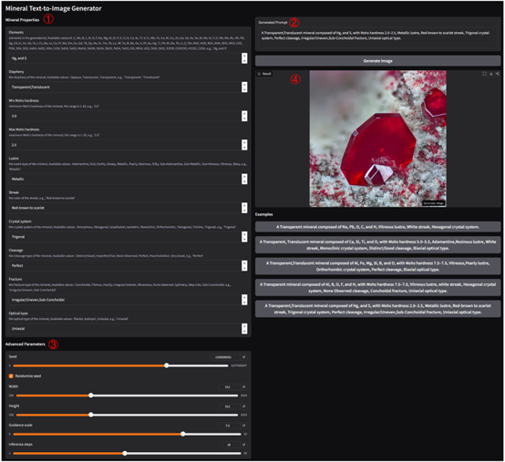

# Stable-Diffusion-Mindat [](https://colab.research.google.com/github/1758310694/Stable-Diffusion-Mindat/blob/main/Stable_Diffusion×Mindat.ipynb)

This project aims to generate mineral images based on a combination of textual properties from Mindat. This is achieved by fine-tuning Stable Diffusion using Mindat data, without relying on specific mineral type information.

The project structure is as follows:
```
├── Stable_Diffusion×Mindat.ipynb      // Dataset construction, model fine-tuning, inference, and evaluation process.
├── SD_Mindat                 // An interactive tool
│   ├── app.py               // Tool main program
│   ├── requirements.txt     // Other dependencies
│   ├── download_model.py    // Weight model download
│   ├── README.md         // Tool build instructions
│   └── Dockerfile         // Docker configuration file
└── README.md           // General Instructions
```

The `Stable_Diffusion×Mindat.ipynb` notebook contains the process for creating the Mindat image-text pair dataset, the specific parameter values ​​for model fine-tuning, and the workflow for inference and evaluation of the fine-tuned model. It can be easily run and viewed on Google Colab.

`SD_Mindat` develops fine-tuned models into an interactive tool that is convenient and easy for users to use. The usage process is as follows:


