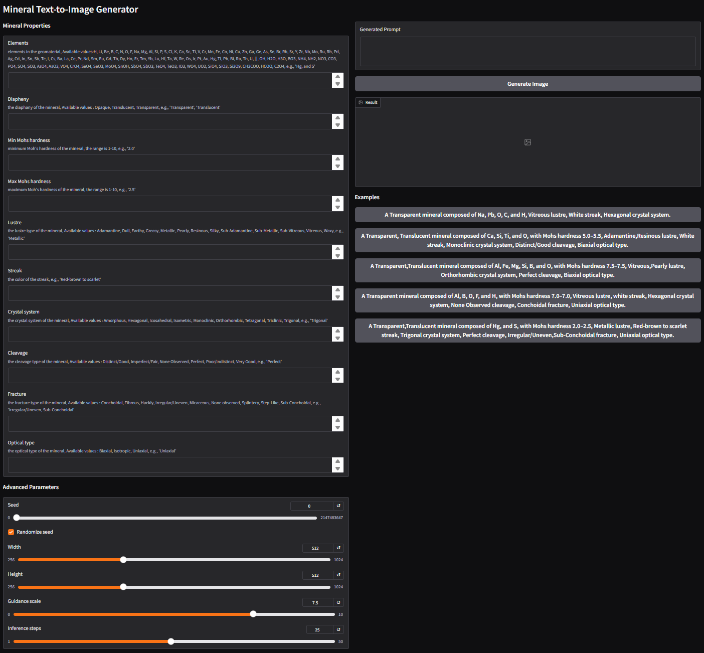

# Interactive tool for generating mineral images based on text properties.

Hugging Face Spaces deployment: https://huggingface.co/spaces/Quanli1/SD_Mindat
Local deployment (publicly accessible): https://mineral-sd-ft.giswetland.com/


## 1、This project supports rapid deployment based on Hugging Face Spaces. 
You can directly use the interactive application framework provided by Spaces and replace the default `app.py` with `Stable-Diffusion-Mindat/SD_Mindat/app.py` from this repository to obtain a customized interface and functionality. See the example space: https://huggingface.co/spaces/Quanli1/SD_Mindat. Deployment can be completed by replacing the script in the same way.


## 2、Local deployment && public network access
### Getting Started
### Prerequisites

Please ensure your operating environment meets the following requirements:

- **Docker**（We recommend using Docker Desktop.）
- **NVIDIA GPU**
- **CUDA 12.6**
- **NVIDIA Container Toolkit**（Used for calling the GPU from within Docker.）
- **Python 3.10 + pip**（Used for downloading models.）
- **cloudflared**（Used to expose local services to the public internet.）
 
### Verify Environment

Execute the following command in the command line to confirm that the environment is configured correctly:

```cmd
# Check the Docker version to confirm that Docker is installed correctly.
docker --version

# Check the CUDA version (nvcc compiler) to confirm that the GPU driver and CUDA are available.
nvcc -V

# Check your Python version to confirm that Python 3.10 or later is installed.
python --version

# Check the pip version to confirm that pip is available.
pip --version
```

### Code acquisition (Install)
#### Method 1: Download the source code directly.

On the GitHub project page, click **Code → Download ZIP** to download and extract the source code.

#### Method 2: Use Git cloning (recommended)
```cmd
git clone https://github.com/1758310694/Stable-Diffusion-Mindat.git

```

### Detailed Configuration (Setup)
```cmd
# Enter the project directory. (Default project files are located at C:/Users/Lenovo/Desktop)
cd ./Stable-Diffusion-Mindat/SD_Mindat

# Pull the official Python 3.10 slim base image.
docker pull python:3.10-slim

# Build a Docker image (df-mineral-cu126) based on the Dockerfile in the current directory.
docker build -t df-mineral-cu126 .

# Install Hugging Face Hub (for model download and management)
pip install huggingface_hub

# Execute a custom Python script to download the necessary Stable Diffusion model Quanli1/sd-1.5-FT from Hugging Face.
# The default download path is C:/Users/Lenovo/hf_cache, which can be modified in the script.
python download_model.py

```

### Run a Docker container（Run Container）
```cmd
# Run the Docker container, using the GPU and mapping port 7860.
# -v Maps the local model cache directory to the container, ensuring the model is available.
# If you have modified the default download path, please modify the mount path accordingly.
# After the container starts, execute `app.py` to launch the application.
docker run -it --gpus all -p 7860:7860 -v C:/Users/Lenovo/hf_cache:/root/.cache/huggingface/hub df-mineral-cu126  python app.py

# Expose the local application to the public network (optional)
# After execution, the terminal will output a randomly generated public IP address, for example:https://xxxx.trycloudflare.com
cloudflared tunnel --url http://localhost:7860
```

### Operating Instructions（Usage）

After the Docker container has started and the model has been downloaded, you can use the mineral image generation application in the following ways:

#### 1. Local access

Open your web browser and access the local service address: http://localhost:7860

You can then access the visual interface and enter text prompts to generate mineral images.

#### 2. Public network access (optional)

If Cloudflare Tunnel is enabled, exposing your local service to the public internet, it can be accessed via a random address displayed in the terminal output, for example: https://xxxx.trycloudflare.com

This interactive tool is now publicly available at https://exclude-phrases-planet-blonde.trycloudflare.com

The interface of this interactive tool is shown below:



